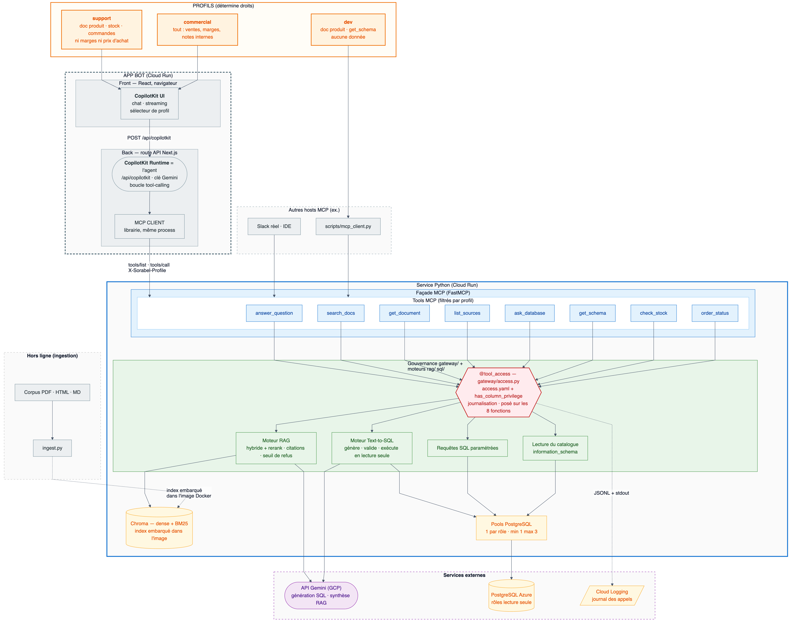
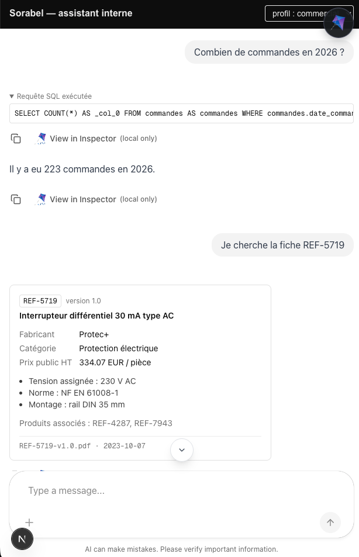

# Sorabel Data Gateway

Point d'accès unique aux données de **Sorabel**, distributeur B2B de matériel électrique et d'outillage professionnel. La gateway expose, via un **serveur MCP**, le corpus documentaire (fiches techniques, notices, procédures SAV, notes internes) et la base SQL (produits, stocks, commandes, clients, ventes) à tous les outils internes — bot Slack du support, IDE des développeurs, poste des commerciaux — sous une gouvernance commune : matrice d'accès par profil, lecture seule stricte côté SQL, journal de tous les appels.

---

> **Serveur MCP gouverné** exposant à plusieurs clients internes (bot Slack du
> support, IDE, poste commercial) deux capacités sur les données d'un
> distributeur B2B : **RAG hybride** sur 350 documents techniques et
> **Text-to-SQL en lecture seule** — sous une matrice d'accès unique et un
> journal exhaustif des appels.
> Projet de fin de spécialisation en IA agentique, construit de zéro sur un
> brief imposé et une suite d'acceptance fournie qui fait office de contrat.

<p align="center">
  <a href="docs/img/flux-complet.png">
    
  </a>
  <br><em>Le flux complet, des sources aux clients — cliquer pour agrandir.</em>
</p>

| Ce que le projet a demandé | Où le lire |
|---|---|
| **Protocole MCP** : deux transports (stdio, Streamable HTTP), catalogue de 8 tools, tool de haut niveau *et* briques utilisables séparément | [`mcp_server/`](mcp_server/), [`gateway/tools.py`](gateway/tools.py) |
| **RAG avancé** : dédoublonnage par version, chunking et métadonnées, dense + BM25 fusionnés par RRF, porte de pertinence plutôt qu'hallucination | [`ingest/`](ingest/), [`retrieval/`](retrieval/) |
| **Text-to-SQL sûr** : schéma commenté en prompt, validation `sqlglot`, `LIMIT` injecté, rôles PostgreSQL par profil — trois barrières indépendantes, pas une | [`sql/`](sql/), [`scripts/roles.py`](scripts/roles.py) |
| **Autorisation déclarative** hors du code, appliquée à l'entrée de tous les appels, chacun journalisé — autorisé comme refusé | [`access.yaml`](access.yaml), [`gateway/access.py`](gateway/access.py) |
| **Évaluation chiffrée** plutôt qu'affirmée : deux métriques, un jeu de questions versionné | [`eval/`](eval/), [`eval/rapport_gain.md`](eval/rapport_gain.md) |
| **Client agentique et déploiement** : app bot Next.js + CopilotKit, images Docker, Cloud Run | [`ui/`](ui/), [`Dockerfile`](Dockerfile), [`docs/deploiement.md`](docs/deploiement.md) |

**Mesuré, pas affirmé** — recherche par référence exacte (`REF-8842`) : MRR
**0.00** en dense → **1.00** en hybride · pertinence sémantique : Recall@5
**79 % → 93 %** · Text-to-SQL **24/24**, dont 8 cas dont le succès *est* un
refus · suite d'acceptance E1–E6 verte.

---

## Features

- Recherche documentaire hybride : dense + lexicale fusionnées par RRF, routage par référence exacte, réponses sourcées (titre + référence + date), refus explicite hors corpus — **gain mesuré dans `eval/rapport_gain.md`**
- Accès aux données en langage naturel : génération Gemini, **validation `sqlglot` avant exécution**, connexion en lecture seule, `LIMIT` injecté, périmètre de tables et de colonnes par profil, requête toujours renvoyée avec le résultat — **24/24 sur `eval/questions_sql.jsonl`**
- Tools figés pour les besoins récurrents, sans LLM : `check_stock`, `order_status`
- Serveur MCP unique exposant les 8 tools du catalogue, sous matrice d'accès par profil (`support`, `commercial`, `dev`) avec journalisation de chaque appel
- Données en place : base SQL générée par `scripts/seed.py`, corpus de 400 fichiers → 350 documents indexés après dédoublonnage par version
- Client MCP de test jouable avec les deux profils, en stdio ou en HTTP (`scripts/mcp_client.py`)
- App bot de démonstration (Next.js + CopilotKit, agent Gemini) branchée sur `/mcp` comme le serait Slack


## Les exigences imposées

Le brief fixe six exigences ; elles sont la raison d'être de chaque choix
d'architecture, et la suite d'acceptance les vérifie une par une.

| | |
|---|---|
| **E1** | Toute réponse documentaire cite ses sources (titre + référence + date) ; hors corpus, l'outil le dit au lieu d'inventer |
| **E2** | La recherche trouve aussi bien par référence exacte (`REF-8842`) que par question en langage naturel |
| **E3** | Tout SQL exécuté est en lecture seule, restreint aux tables du profil ; la requête générée est renvoyée avec son résultat |
| **E4** | Un même serveur MCP sert tous les clients ; chacun n'accède qu'aux tools, collections et tables prévus par la matrice |
| **E5** | Tout appel est journalisé, autorisé ou refusé ; les colonnes sensibles ne sortent jamais pour le profil support |
| **E6** | Le gain de la recherche avancée sur la recherche simple est mesuré et documenté |

## Stack

- Python 3.11 (géré avec `uv`)
- Chroma pour l'index vectoriel (`docker compose`, port 8002)
- PostgreSQL pour la base (`docker compose`, port 8003 ; serveur Azure en ligne) — un rôle par profil, `GRANT SELECT` colonne par colonne, un pool chacun
- SQLite (`data/sorabel.db`) reste la **référence** : `make seed` la génère, `make migrate` la recopie vers PostgreSQL, et `tests/conftest.py` y calcule les attendus de la suite d'acceptance
- `sqlglot` pour valider le SQL généré avant exécution, `google-genai` pour le générer
- `fastembed` pour les embeddings (ONNX, multilingue, ~250 Mo — pas de PyTorch) et `rank-bm25` pour la piste lexicale
- SDK MCP (`mcp`) pour le serveur — deux canaux : stdio et Streamable HTTP sur `/mcp`
- Next.js + CopilotKit (`ui/`) pour l'app bot, agent Gemini via l'AI SDK
- `pypdf` / `beautifulsoup4` pour l'extraction du corpus

## Démarrage

```bash
make install      # uv sync
make up           # Chroma (8002) et PostgreSQL (8003)
make seed         # génère data/sorabel.db (déterministe, aligné sur le corpus)
make migrate      # recopie la SQLite vers PostgreSQL, commentaires compris
make roles        # un rôle par profil, GRANT dérivés d'access.yaml
make ingest       # construit l'index documentaire (.chroma/) — requis avant make test
make eval         # régénère eval/rapport_gain.md (E6)
make eval-sql     # joue eval/questions_sql.jsonl (24 appels Gemini ; TYPES=ecriture,ambigue pour n'en jouer qu'une part)
make test         # suite d'acceptance — verte
make serve        # serveur MCP stdio (profil via SORABEL_PROFILE)
make serve-http   # serveur MCP Streamable HTTP sur http://127.0.0.1:8000/mcp
make client       # client de test (PROFILE=support|commercial)
```

`make test` a besoin des cinq premières lignes : la suite interroge la base par
la gateway, donc sous le rôle du profil. Copier `.env.example` vers `.env`
suffit à fournir `DATABASE_URL` et les mots de passe de rôle de développement.

### App bot (démo)

L'app bot est un client MCP parmi d'autres : elle simule le bot Slack du
support. Elle ne porte aucune logique métier — tout passe par `/mcp`.

<p align="center">
  <a href="docs/img/app-bot.png">
    
  </a>
  <br><em>Les deux capacités côte à côte : Text-to-SQL, requête générée affichée avec le résultat ; puis recherche par référence exacte, fiche sourcée.</em>
</p>

```bash
cp ui/.env.example ui/.env         # y coller GOOGLE_API_KEY
make ui-install                    # npm install
make serve-http                    # terminal 1 — la gateway
make ui                            # terminal 2 — http://localhost:3000
make ui-fmt                        # Biome : formatage + retrait des imports inutilisés
make ui-clean                      # vide ui/.next — si le dev server reste sur « Compiling / »
```

Le formatage et le retrait des imports inutilisés se font **à l'enregistrement**
via Biome (`ui/biome.json`, réglages dans `.vscode/`) ; ESLint reste chargé des
règles propres à Next.

**Clés Gemini — une par service.** L'app bot lit `ui/.env`, le serveur Python
lit le `.env` du dépôt (`GOOGLE_API_KEY`, pour `ask_database`) : deux déploiements Cloud Run distincts à l'étape 6,
donc deux configurations. Les deux clés vivent côté serveur et n'atteignent
jamais le navigateur (Next n'expose au bundle que les variables `NEXT_PUBLIC_*`).
À créer sur [aistudio.google.com/apikey](https://aistudio.google.com/apikey).
L'abonnement Google AI Pro ne donne pas d'accès API : le quota vient du free
tier d'AI Studio (projet **sans** facturation), du prépaiement AI Studio, ou de
Vertex AI. Un projet en prépaiement à zéro renvoie `429 RESOURCE_EXHAUSTED`
sans repli sur le free tier.

Modèles épinglés plutôt qu'un alias `-latest`, pour que les mesures restent
reproductibles : `google/gemini-3.6-flash` pour l'agent du bot,
`gemini-3.5-flash-lite` pour la génération SQL (`SORABEL_SQL_MODEL`).

La CI a besoin du même secret : `GOOGLE_API_KEY` dans *Settings → Secrets and
variables → Actions*. Sans lui, les quatre tests d'acceptance SQL échouent.

Le sélecteur de profil de l'UI pose l'en-tête `X-Sorabel-Profile` sur l'appel
au runtime ; le runtime le réémet vers `/mcp` via `options.fetch` du transport
MCP. Le navigateur ne voit jamais `/mcp`.

Exemples côté client :

```bash
uv run python scripts/mcp_client.py --profile support --tool search_docs --args '{"query": "REF-8842"}'
uv run python scripts/mcp_client.py --profile commercial --tool ask_database --args '{"question": "combien de commandes en avril ?"}'
```

## Layout

```
data/
  corpus/             # ~400 documents : fiches/ notices/ (PDF), sav/ (HTML), notes/ (Markdown)
  sorabel.db          # base SQL (hors git — générée par make seed, schéma dans docs/schema.sql)
docs/
  deploiement.md      # ce qui se configure à la main, et pourquoi (identifiants anonymisés)
  img/flux-complet.png
  schema.sql          # schéma commenté de la base (colonnes sensibles signalées)
eval/
  questions_rag.jsonl # questions documentaires : couvertes, hors corpus, par référence exacte
  questions_sql.jsonl # questions métier en langage naturel, dont cas limites
  run_eval.py         # mesure dense vs lexical vs hybride → rapport_gain.md
  run_eval_sql.py     # joue les 24 questions SQL : génération, refus, périmètre
ingest/               # parse.py (métadonnées déclarées, dédoublonnage), index.py (Chroma)
retrieval/            # embed.py, search.py (hybride + porte de pertinence), answer.py
sql/                  # schema.py (introspection : une source pour le prompt et le garde), generate.py, guard.py, db.py, reglages.py
gateway/              # la gouvernance : matrice d'accès, journal, catalogue des 8 tools
mcp_server/           # les deux canaux : server.py (stdio), http_server.py (/mcp)
scripts/
  seed.py             # génère et peuple data/sorabel.db
  migrate.py          # SQLite → PostgreSQL : DDL transposé, COMMENT ON, COPY
  roles.py            # un rôle par profil, GRANT SELECT dérivés d'access.yaml
  mcp_client.py       # client MCP de test (stdio, ou --http)
tests/acceptance/     # suite d'acceptance boîte noire, adossée aux exigences E1–E6
ui/                   # app bot de démo — Next.js + CopilotKit, agent Gemini
```
